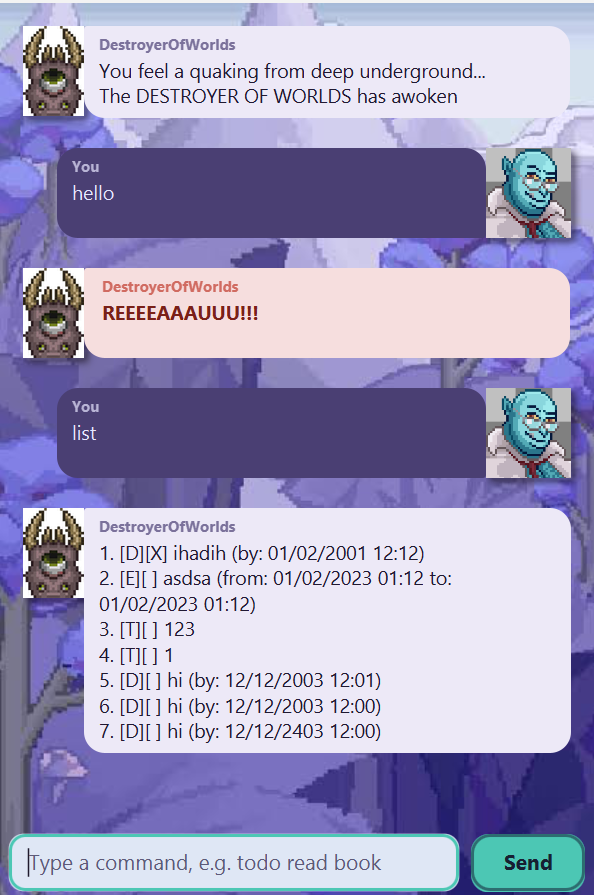

# DestroyerOfWorlds User Guide



DestroyerOfWorlds is a desktop chatbot for tracking your to-dos, deadlines and events.
It's optimized for fast typists — manage your entire task list by typing simple text
commands into a single input box, no mouse required.

## Adding todos

Adds a simple to-do task with no attached date or time.

Example: `todo <description>`

Example: `todo read book`

```
Added: [T][ ] read book
```

## Adding deadlines

Adds a task that must be done by a specific date and time.

Example: `deadline <description> /by <dd/MM/yyyy HH:mm>`

Example: `deadline submit report /by 09/09/2026 23:59`

```
Added: [D][ ] submit report (by: 09/09/2026 23:59)
```

## Adding events

Adds a task that spans a start and end date/time.

Example: `event <description> /from <dd/MM/yyyy HH:mm> /to <dd/MM/yyyy HH:mm>`

Example: `event team meeting /from 09/09/2026 10:00 /to 09/09/2026 11:00`

```
Added: [E][ ] team meeting (from: 09/09/2026 10:00 to: 09/09/2026 11:00)
```

## Listing all tasks

Shows every task currently in your list, numbered in the order they were added.

Example: `list`

```
1. [T][ ] read book
2. [D][ ] submit report (by: 09/09/2026 23:59)
3. [E][ ] team meeting (from: 09/09/2026 10:00 to: 09/09/2026 11:00)
```

## Marking and unmarking tasks

Marks a task as done, or reverts it back to not done, using its number from `list`.

Example: `mark <task number>` or `unmark <task number>`

Example: `mark 1`

```
ok, marked Task1 as done
```

## Deleting tasks

Removes a task from the list using its number from `list`.

Example: `delete <task number>`

Example: `delete 1`

```
Removed: [T][X] read book
```

## Finding tasks

Searches for tasks whose description contains the given keyword (case-insensitive).

Example: `find <keyword>`

Example: `find report`

```
Here are the matching tasks in your list:
2. [D][ ] submit report (by: 09/09/2026 23:59)
```

## Exiting the program

Closes the application.

Example: `bye`

```
seeya cutie ;)
```